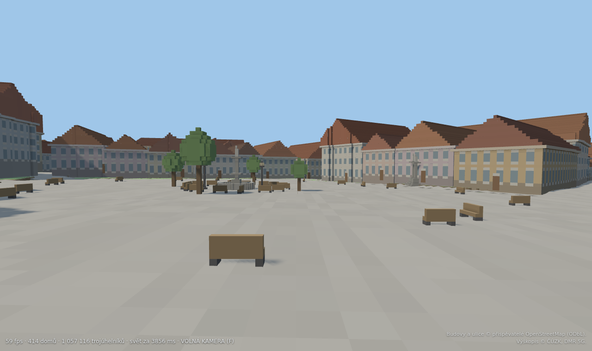
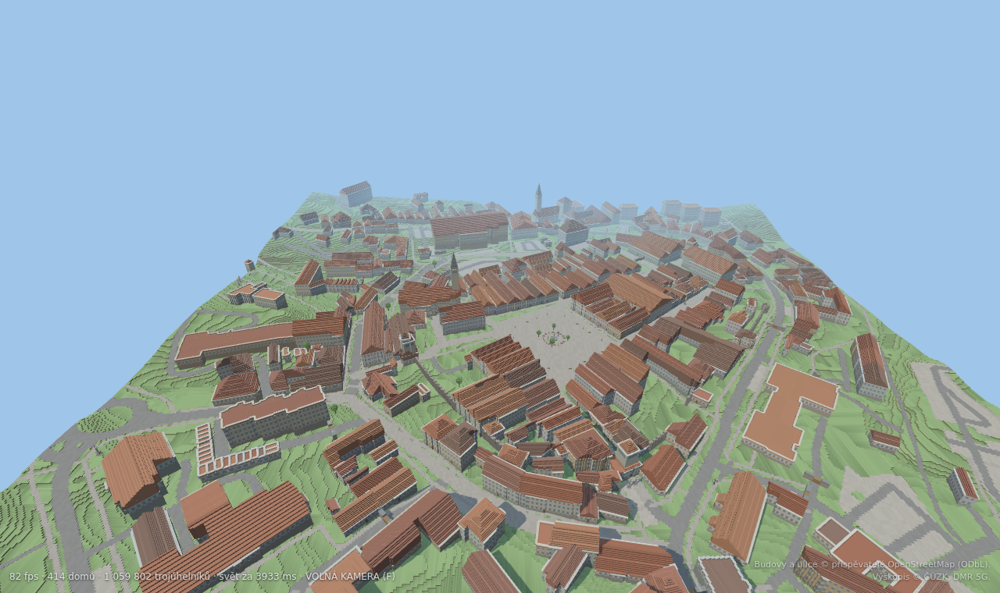
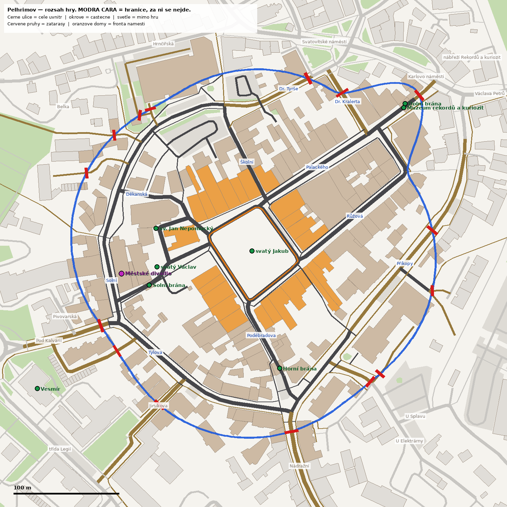
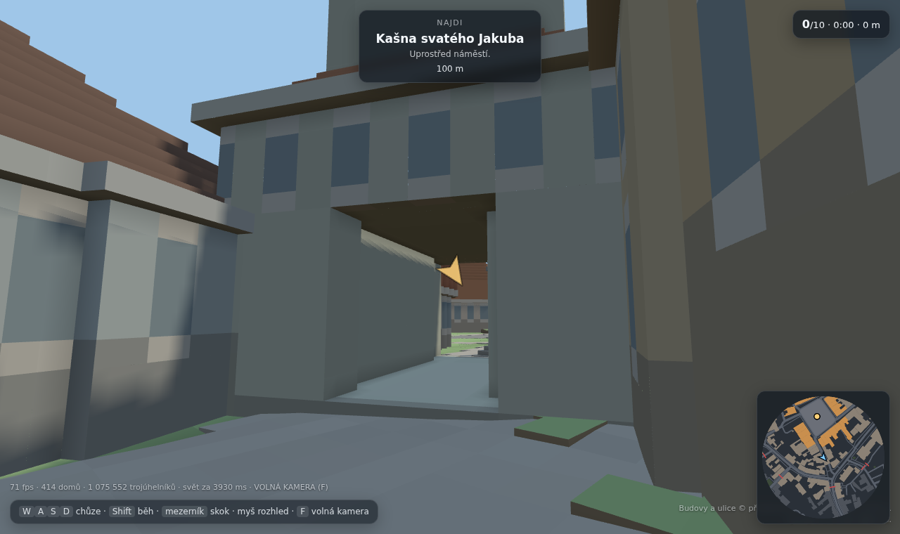

# Pelhřimov

Webová 3D hra: **skutečné historické jádro Pelhřimova** postavené z voxelů.
Masarykovo náměstí, blok měšťanských domů kolem něj, okružní ulice, tři brány
a hradby — všechno podle reálných map, ne podle fantazie. Chodí se po něm
pěšky a hledá se deset pamětihodností.

Grafika míří na Roblox, ne na Minecraft: matné plochy, čisté barvy, žádné
textury. Objem dělá geometrie a spékané stínění v rozích.




```bash
npm install
npm run world      # stáhne data a postaví src/data/pelhrimov.json (cachuje se)
npm run dev        # http://<ip>:5189
npm test           # projde se město a ověří, že jsou všechny cíle dosažitelné
npm run plan       # kontrolní půdorysy do data/
npm run build      # produkční build do dist/
```

## Ovládání

| | |
|---|---|
| Chůze | `W` `A` `S` `D` nebo šipky |
| Běh | `Shift` |
| Skok | `mezerník` |
| Rozhled | myš (kliknutím se zamkne kurzor) |
| Volná kamera | `F` |
| Mobil | levá půlka obrazovky = chůze, pravá = rozhled |

## Rozsah mapy

Hratelná oblast sahá **130 m od okraje náměstí** a ve třech úzkých výsecích
vybíhá dál, k historickým branám. To přesně obsáhne:

* Masarykovo náměstí (24 domů ve frontě, s hlubokými měšťanskými parcelami),
* blok domů kolem něj,
* celou okružní ulici jádra — Děkanská → Solní → Tylova → Poděbradova →
  Příkopy → Růžová → Palackého → Dr. Tyrše, **náměstí jde obejít dokola**,
* řadu domů na vnější straně okruhu,
* výběžky po ulicích ke třem branám — Dolní brána je od náměstí 164 m, tedy
  daleko za základní hranicí, a bez výběžku by se k Muzeu rekordů nedalo dojít.

Hranice se počítá **jednou** v `scripts/build_world.py` a ukládá do dat; hra,
zátarasy i kontrolní plány pak používají stejný mnohoúhelník.

Kde dnešní ulice vede z této oblasti ven, stojí **kamenný zátaras se zavřenými
vraty** (16 míst). Domy za hranicí zůstávají stát jako kulisa — město se nikde
neuseklo do prázdna, jen se tam nedá dojít.



Branami se prochází — v jejich hmotě je probouraný průjezd a v kolizích stojí
místo celého půdorysu jen dva pilíře. Jinak by tři brány na jediných vstupech
do jádra město uzavřely.



## Odkud jsou data

| Co | Zdroj | Licence |
|---|---|---|
| Půdorysy domů, patra, ulice, hradby, brány, zeleň | OpenStreetMap | ODbL |
| Výškopis terénu | ČÚZK, DMR 5G (ArcGIS ImageServer) | otevřená data |

Obojí stahuje `scripts/build_world.py` a slévá do jednoho JSONu (~240 kB),
ze kterého se svět voxelizuje až v prohlížeči. Surová data se cachují
v `data/` (mimo git), takže opakovaný běh nesahá na síť;
`python3 scripts/build_world.py --refresh` je stáhne znovu.

**Google Street View se použít nedá** — je autorsky chráněný a jeho podmínky
zakazují stahování a další použití. Fasády proto vznikají z OSM (počet pater,
tvar střechy) plus pravidel v `src/buildings.js`.

## Jak je to poskládané

```
scripts/build_world.py    stažení a příprava dat → src/data/pelhrimov.json
scripts/preview_plan.py   kontrolní půdorys celé mapy
scripts/preview_streets.py  plán rozsahu hry s názvy ulic
scripts/shot.mjs          kontrolní snímky běžící hry (headless Chromium)
scripts/play.mjs          automatická procházka — test, že se hra dá dohrát

src/voxel.js      greedy meshing 3D mřížky + mesh terénu z výškové mapy
src/terrain.js    výšková mapa, povrchy, srovnání náměstí do roviny
src/buildings.js  z půdorysu OSM voxelový dům: zdi, okna, římsa, střecha, věž
src/world.js      složení scény po dílech 80 m, zátarasy, hranice, kolize
src/collide.js    kolizní tělesa v mřížce
src/player.js     chůze, gravitace, schody, klávesy a dotyk
src/quests.js     deset pamětihodností a postup
src/ui.js         HUD, šipka k cíli, minimapa, kartičky
src/main.js       scéna, světlo, smyčka
```

### Rozhodnutí, která stojí za vysvětlení

**Mřížka každého domu je natočená podle něj, ne podle světových os.** Reálné
půdorysy z OSM jsou skoro vždy o pár stupňů pootočené a v osové mřížce se
z každé zdi stane schodiště, které se nemá jak slít. Jeden dům pak stál
12 000 trojúhelníků místo 400. Natočená mřížka dá rovné zdi a pravidelnou
střechu; sousední domy nemají voxely v zákrytu, což u Roblox vzhledu nevadí.

**Domy jsou plné, ne duté skořepiny.** Dovnitř se nedá a greedy mesher z plné
hmoty udělá jen vnější plášť. Skořepina naopak generuje i vnitřní líc každé
zdi — na 414 domech rozdíl 3,1 M vs. 0,6 M trojúhelníků.

**Zpevněné plochy jsou spojité, tráva je schodovitá.** Náměstí klesá o 2,5 m;
ve voxelových schodech z něj bylo terasovité hlediště. Dlažba a asfalt proto
berou výšku v rozích buňky (sdílených se sousedy) a náměstí je navíc proložené
přesnou nakloněnou rovinou — domy do ní stojí svisle zapuštěné. Tráva zůstává
po půl metru, aby si svět udržel voxelový charakter tam, kde to sluší.

**Každý sloupec zdi začíná na terénu pod sebou.** Dům nemá zakopanou část,
kterou nikdo neuvidí, a ve svahu mu sám od sebe vyroste vyšší sokl na dolní
straně — přesně jak to na Vysočině vypadá.

## Testy

`npm test` (= `scripts/probe.mjs`) postaví svět v Node — three.js na to DOM
nepotřebuje — a pustí na kolizní model **záplavové vyplnění**: kam až hráč
z náměstí dojde, když smí překročit schod do 0,55 m. Naivní bot, který jde
k cíli po přímce, není důkaz; zasekne se o první dům. Tohle je důkaz.

Aktuálně: 50 113 m² dostupných z 52 123 m² volných uvnitř hranice (96 %,
zbytek jsou uzavřené dvorky za domy), všech deset cílů dosažitelných.

`scripts/play.mjs` a `scripts/shot.mjs` jsou navíc kouřová zkouška a kontrolní
snímky v prohlížeči. Potřebují headless Chromium přes playwright-core, který
**není závislostí projektu** — bere se z toho, co je na stroji, jinou cestu
lze podstrčit přes `PLAYWRIGHT_CORE`. `npm test` je nepotřebuje.

## Stav

Hotové: svět, chůze a kolize, hranice mapy se zátarasy, průchozí brány,
deset úkolů, HUD s minimapou, ovládání na mobilu, test průchodnosti.

Co dál: bohatší fasády domů na náměstí (renesanční štíty, členitější přízemí),
zvuk, denní doba, žebříček časů.
