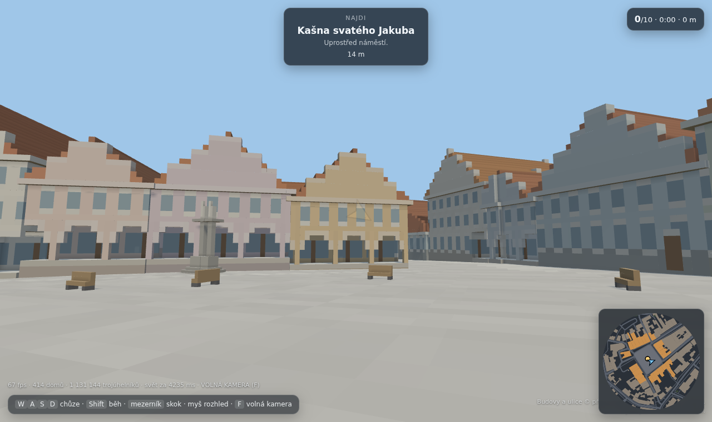
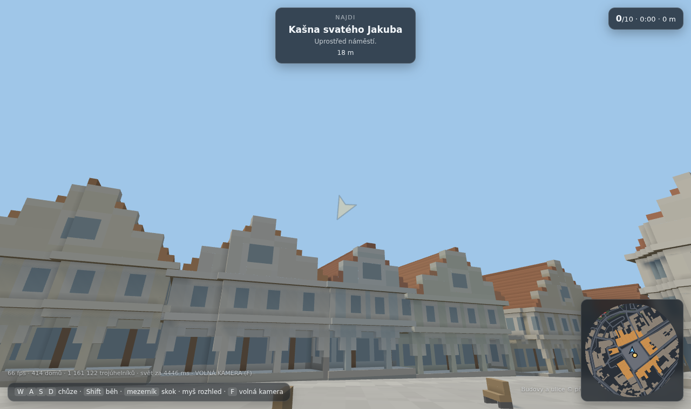
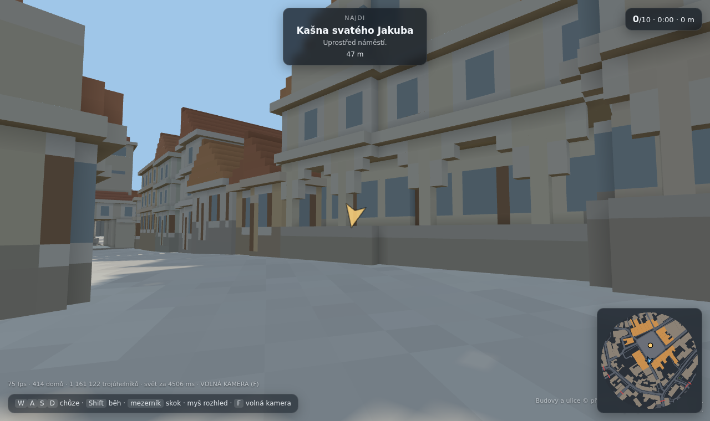
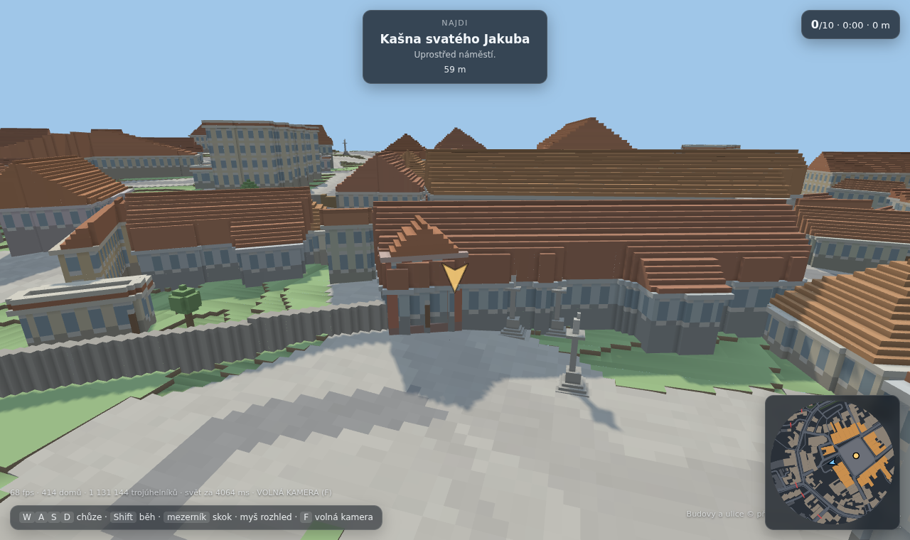

# Pelhřimov

Webová 3D hra: **skutečné historické jádro Pelhřimova** postavené z voxelů.
Masarykovo náměstí, blok měšťanských domů kolem něj, okružní ulice, tři brány
a hradby — všechno podle reálných map, ne podle fantazie. Chodí se po něm
pěšky a hledá se deset pamětihodností.

Grafika míří na Roblox, ne na Minecraft: matné plochy, čisté barvy, žádné
textury. Objem dělá geometrie a spékané stínění v rozích.




```bash
npm install
npm run world      # stáhne data a postaví src/data/pelhrimov.json (cachuje se)
npm run dev        # http://<ip>:5189
npm test           # projde se město a ověří, že jsou všechny cíle dosažitelné
npm run plan       # kontrolní půdorysy do data/
npm run build      # produkční build do dist/
```

## Sbírání bodů volebního programu

Po městě jsou rozvěšené **listiny** — v každém druhém poli podloubí a v průjezdu
všech tří bran. Dohromady je úkrytů 59 (56 v podloubí, 3 v branách), takže se
k nim nedá dostat jinak než obejít celé náměstí i všechny brány. HUD ukazuje
počitadlo po stranách, celkový počet a běžící čas; šipka míří na nejbližší
nesebranou listinu a na minimapě svítí jako tečky.

**Obsah listin se nevymýšlí.** Bere se ze `src/data/program.json`:

```json
{ "id": "ods", "nazev": "ODS", "lidr": "Ladislav Med", "body": [
    { "text": "…doslovný bod programu…", "zdroj": "https://…" } ] }
```

Dokud je `body` u všech stran prázdné, hra sbírá **ukázkové údaje o městě**
z vlastních mapových dat a v HUD na to výslovně upozorňuje. Tři týdny před
volbami je rozdíl mezi mapovým údajem a tím, co slibuje kandidátka, zásadní —
proto to hra nesmí splývat a proto má každý bod povinný `zdroj`.

Ověřené a doplněné: termín voleb (9. a 10. října 2026) a lídři tří kandidátek —
ODS Ladislav Med, KDU-ČSL Karel Kratochvíl, Společně pro Pelhřimov (navrhující
strana TOP 09) Zdeněk Jaroš. Samotné programové body zatím veřejně dostupné
nejsou; jakmile budou, patří do `body` i se zdrojem.

## Nasazení

Statická stránka, žádný backend. Vercel si vystačí s `vercel.json` v repu:
build `npm run build`, výstup `dist/`. **Python se při nasazení nespouští** —
`src/data/pelhrimov.json` je v gitu hotový, `npm run world` je jen vývojářský
krok, když se mají data přegenerovat.

## Ovládání

| | |
|---|---|
| Chůze | `W` `A` `S` `D` nebo šipky |
| Běh | `Shift` |
| Skok | `mezerník` |
| Rozhled | myš (kliknutím se zamkne kurzor) |
| Volná kamera | `F` |
| Mobil | levá půlka obrazovky = chůze, pravá = rozhled |

Na dotykovém zařízení je vlevo dole **nakreslený knipl** se šipkami a popiskem,
kam dát prst; knoflík se při doteku rozsvítí a vychýlí. Při spuštění se navíc
na sedm vteřin ukáže karta s ovládáním (jiná pro dotyk a pro klávesnici),
která zmizí sama nebo prvním dotykem či klávesou.

## Rozsah mapy

Hratelná oblast sahá **130 m od okraje náměstí** a ve třech úzkých výsecích
vybíhá dál, k historickým branám. To přesně obsáhne:

* Masarykovo náměstí (24 domů ve frontě, s hlubokými měšťanskými parcelami),
* blok domů kolem něj,
* celou okružní ulici jádra — Děkanská → Solní → Tylova → Poděbradova →
  Příkopy → Růžová → Palackého → Dr. Tyrše, **náměstí jde obejít dokola**,
* řadu domů na vnější straně okruhu,
* výběžky po ulicích ke třem branám — Dolní brána je od náměstí 164 m, tedy
  daleko za základní hranicí, a bez výběžku by se k Muzeu rekordů nedalo dojít.

Hranice se počítá **jednou** v `scripts/build_world.py` a ukládá do dat; hra,
zátarasy i kontrolní plány pak používají stejný mnohoúhelník.

Kde dnešní ulice vede z této oblasti ven, stojí **kamenný zátaras se zavřenými
vraty** (16 míst). Domy za hranicí zůstávají stát jako kulisa — město se nikde
neuseklo do prázdna, jen se tam nedá dojít.


Branami se prochází — v jejich hmotě je probouraný průjezd a v kolizích stojí
místo celého půdorysu jen dva pilíře. Jinak by tři brány na jediných vstupech
do jádra město uzavřely.


## Fasády podle fotografií

Půdorys, patra a tvar střechy dává OpenStreetMap. Co OSM neví, je doplněné
podle fotografií na **Wikimedia Commons** (vše CC BY / CC BY-SA), ne odhadem:

* **Podloubí** se neodhaduje podle strany náměstí. Odhad "celá fronta kromě
  jižní strany" se pletl — Komerční banka ani čp. 78 a 79 podloubí nemají,
  přestože na "podloubené" straně stojí. Bere se ze dvou tvrdých zdrojů:
  OSM cesty s `covered=arcade` (69 m dlouhá fronta čp. 1–6) a ručních
  záznamů v `src/data/domy.json`. Co není doloženo, podloubí nedostane —
  chybějící podloubí je menší chyba než vymyšlené. Dělá se skutečným
  odebráním hmoty z přízemí, takže se pod ním dá projít, a proto je o jeho
  hloubku zmenšený i kolizní obrys domu.
* **Renesanční štíty** — domy stojí na hlubokých parcelách, hřeben míří od
  náměstí pryč a do náměstí kouká štítová stěna. Ta se vytáhne nad krytinu
  a její obrys se odstupňuje.
* **Výšky dominant** — OSM u nich nemá žádnou výšku a paušální odhad byl
  špatně. Dolní (Jihlavská) brána je vysoká věž (~36 m) s měděnou lucernou,
  Horní (Rynárecká) brána nižší věž s ochozem, **Solní brána jen nízký
  patrový domek** — ten dřív dostával sedmnáctimetrovou věž, kterou nemá.
* **Barvy** — střechy jsou cihlově oranžové, ne hnědé; fasády pastelové.

### Údaje po jednotlivých domech

OSM uvádí tvar střechy u 35 budov z 1566 — zbytek je odhad z poměru stran
půdorysu. Na měšťanský dům na hluboké parcele sedí (hřeben kolmo k náměstí,
do něj kouká štít), na blok banky nebo hotelu ne. Proto:

* velká veřejná stavba (nad 420 m², `civic`/`commercial`/`hotel`/…) dostane
  valbovou střechu s **hřebenem podél ulice**, ne sedlovku do hloubky parcely,
* `src/data/domy.json` drží ruční záznamy pro konkrétní domy — počet pater,
  tvar střechy, směr hřebene, podloubí, barvy. **Každý záznam musí mít
  `zdroj`**, jinak build spadne. Dnes je jich 13: Komerční banka, Česká
  spořitelna, Hotel Slávie, čp. 78 a 79 a osm domů podloubené fronty.

Tak se opravila Komerční banka: měla sedlovku jako měšťanský dům, podloubí,
které nemá, a barvu z pastelové palety. Teď je to šedý blok s valbovou
střechou podél náměstí.

### Dvě úrovně detailu fasády

Propracovanou fasádu dostane **82 domů**: celá fronta náměstí a domy v ulicích,
které z náměstí vedou k branám. Ty ulice se nehádají podle názvu — z ulic se
postaví graf a Dijkstrou se najde nejkratší cesta od náměstí ke každé bráně
(vyjde Solní, Poděbradova, Růžová a Palackého, tedy přesně radiály k branám).

Skladba takové fasády: sokl — přízemní výkladec v tmavém rámu (nebo podloubí) —
kordonová římsa — okno v bílém ostění ze všech čtyř stran — hlavní římsa —
odstupňovaný štít s podkrovním oknem. Rytmus se odvozuje od středu fasády, aby
vyšel symetricky; perioda 3 m (pilíř 1 m, ostění 0,5 m, okno 1 m, ostění 0,5 m).

Zbylých 332 domů má holé okno bez ostění. Hráč k nim nedojde blíž než na druhou
stranu ulice a plná skladba by jen ztrojnásobila geometrii.



Hradby zůstávají skromné: OSM u nich neuvádí výšku ani tvar, takže se kreslí
jako 3,5 m kamenná zeď. Zubaté cimbuří z prvního pokusu byl výmysl a u Solní
brány z něj byl hrad, který tam nestojí.



## Odkud jsou data

| Co | Zdroj | Licence |
|---|---|---|
| Půdorysy domů, patra, ulice, hradby, brány, zeleň | OpenStreetMap | ODbL |
| Výškopis terénu | ČÚZK, DMR 5G (ArcGIS ImageServer) | otevřená data |
| Podoba fasád, podloubí, výšky věží | fotografie na Wikimedia Commons (jen jako předloha, do hry se nekopírují) | CC BY / CC BY-SA |

Obojí stahuje `scripts/build_world.py` a slévá do jednoho JSONu (~240 kB),
ze kterého se svět voxelizuje až v prohlížeči. Surová data se cachují
v `data/` (mimo git), takže opakovaný běh nesahá na síť;
`python3 scripts/build_world.py --refresh` je stáhne znovu.

**Google Street View se použít nedá** — je autorsky chráněný a jeho podmínky
zakazují stahování a další použití. Fasády proto vznikají z OSM (počet pater,
tvar střechy) plus pravidel v `src/buildings.js`.

## Jak je to poskládané

```
scripts/build_world.py    stažení a příprava dat → src/data/pelhrimov.json
scripts/preview_plan.py   kontrolní půdorys celé mapy
scripts/preview_streets.py  plán rozsahu hry s názvy ulic
scripts/shot.mjs          kontrolní snímky běžící hry (headless Chromium)
scripts/play.mjs          automatická procházka — test, že se hra dá dohrát

src/voxel.js      greedy meshing 3D mřížky + mesh terénu z výškové mapy
src/terrain.js    výšková mapa, povrchy, srovnání náměstí do roviny
src/buildings.js  z půdorysu OSM voxelový dům: zdi, okna, římsa, střecha, věž
src/world.js      složení scény po dílech 80 m, zátarasy, hranice, kolize
src/collide.js    kolizní tělesa v mřížce
src/player.js     chůze, gravitace, schody, klávesy a dotyk
src/quests.js     deset pamětihodností a postup
src/collect.js    listiny s body programu schované v podloubí a branách
src/ui.js         HUD, šipka k cíli, minimapa, kartičky
src/main.js       scéna, světlo, smyčka
```

### Rozhodnutí, která stojí za vysvětlení

**Mřížka každého domu je natočená podle něj, ne podle světových os.** Reálné
půdorysy z OSM jsou skoro vždy o pár stupňů pootočené a v osové mřížce se
z každé zdi stane schodiště, které se nemá jak slít. Jeden dům pak stál
12 000 trojúhelníků místo 400. Natočená mřížka dá rovné zdi a pravidelnou
střechu; sousední domy nemají voxely v zákrytu, což u Roblox vzhledu nevadí.

**Domy jsou plné, ne duté skořepiny.** Dovnitř se nedá a greedy mesher z plné
hmoty udělá jen vnější plášť. Skořepina naopak generuje i vnitřní líc každé
zdi — na 414 domech rozdíl 3,1 M vs. 0,6 M trojúhelníků.

**Chodník jen v pásu kolem vozovek.** OSM v jádru chodníky skoro nemá, takže
všechno mezi vozovkou a domem zůstávalo výchozí trávou — kolem náměstí z toho
byly zelené dlaždice přesně tam, kde je dlažba. Plošné vydláždění celého jádra
to přehnalo na druhou stranu a vydláždilo i dvorky. Dlažba se proto rozlije
3 m od každé ulice a 8 m uvnitř jádra; dál zůstane zeleň.

**Zpevněné plochy jsou spojité, tráva je schodovitá.** Náměstí klesá o 2,5 m;
ve voxelových schodech z něj bylo terasovité hlediště. Dlažba a asfalt proto
berou výšku v rozích buňky (sdílených se sousedy) a náměstí je navíc proložené
přesnou nakloněnou rovinou — domy do ní stojí svisle zapuštěné. Tráva zůstává
po půl metru, aby si svět udržel voxelový charakter tam, kde to sluší.

**Dům „kouká" podle nejbližšího rohu, ne podle těžiště.** Měšťanské domy stojí
na hlubokých parcelách; jeden má 54 m a jeho těžiště leží 48 m od náměstí,
takže při měření z těžiště propadl přes limit a zůstal úplně bez podloubí
i bez portálu — právě z něj byla ta viditelná stěna v průchodu.

**Každý sloupec zdi začíná na terénu pod sebou.** Dům nemá zakopanou část,
kterou nikdo neuvidí, a ve svahu mu sám od sebe vyroste vyšší sokl na dolní
straně — přesně jak to na Vysočině vypadá.

## Testy

`npm test` (= `scripts/probe.mjs`) postaví svět v Node — three.js na to DOM
nepotřebuje — a pustí na kolizní model **záplavové vyplnění**: kam až hráč
z náměstí dojde, když smí překročit schod do 0,55 m. Naivní bot, který jde
k cíli po přímce, není důkaz; zasekne se o první dům. Tohle je důkaz.

Aktuálně: 50 113 m² dostupných z 52 123 m² volných uvnitř hranice (96 %,
zbytek jsou uzavřené dvorky za domy), všech deset cílů dosažitelných.

`scripts/play.mjs` a `scripts/shot.mjs` jsou navíc kouřová zkouška a kontrolní
snímky v prohlížeči. Potřebují headless Chromium přes playwright-core, který
**není závislostí projektu** — bere se z toho, co je na stroji, jinou cestu
lze podstrčit přes `PLAYWRIGHT_CORE`. `npm test` je nepotřebuje.

## Stav

Hotové: svět, chůze a kolize, hranice mapy se zátarasy, průchozí brány,
podloubí a propracované fasády na náměstí i v ulicích k branám, deset úkolů,
sbírání listin s počitadlem a časem, HUD s minimapou, ovládání na mobilu,
test průchodnosti i dosažitelnosti všech listin.

Čeká na obsah: body volebních programů ODS, KDU-ČSL a Společně pro Pelhřimov
v `src/data/program.json`.

Co dál: zvuk, denní doba, žebříček časů, interiéry podloubí s obchody.
